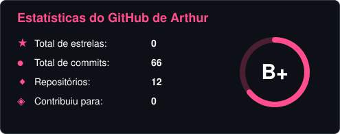

<h1>Oie! Eu sou o Arthur.</h1>

Estudante de ADS | Apaixonado por TI

  
  

 

<h3>💻 Tecnologias que utilizo</h3>

  &nbsp;&nbsp;&nbsp;
  &nbsp;&nbsp;&nbsp;
  &nbsp;&nbsp;&nbsp;
  

 

<h3>🌐 Me encontre por aqui</h3>

&nbsp;

&nbsp;

